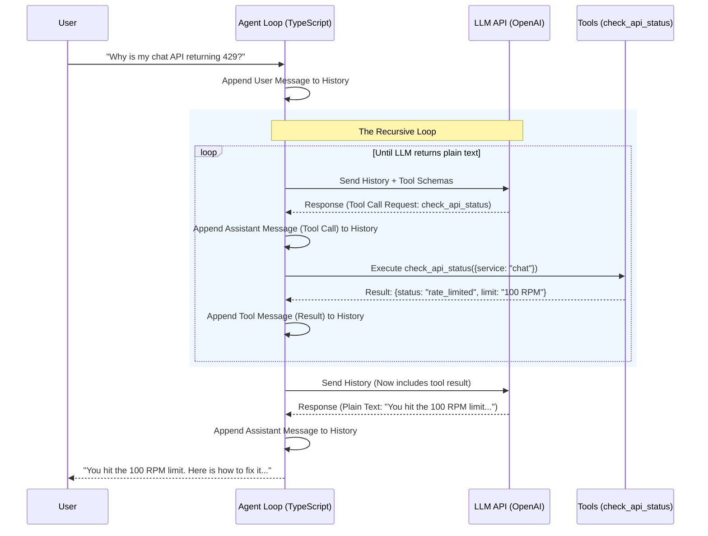

# Technical Design Document (TDD): v1 AI Customer Service Agent

**Author:** Manus AI (with user)
**Date:** June 22, 2026
**Status:** Draft

## 1. System Overview

This TDD outlines the architecture for a v1 AI Customer Service Agent built in TypeScript from scratch. The agent operates in the domain of developer support for an LLM/AI API platform. It is designed to diagnose issues, query a knowledge base, and execute a read-only tool to assist developers.

This document serves as the technical blueprint for the build phase and as a foundational text for the accompanying educational blog series, explicitly contrasting our from-scratch implementation with modern framework abstractions.

## 2. Core Architecture: The Agent Loop

The heart of the system is the Agent Loop, a state machine that orchestrates the conversation between the user, the LLM, and the available tools.

### 2.0 Architecture Diagram

The sequence below visualizes the recursive tool-calling loop. This is the core engine we are building from scratch.



### 2.1 From-Scratch Implementation

Our custom loop will be a recursive or `while` loop that processes a conversation history array (`Message[]`).

**The Flow:**
1.  **Receive Input:** User sends a message. Append `{ role: 'user', content: '...' }` to history.
2.  **LLM Inference:** Send the history (plus system prompt and tool definitions) to the LLM API.
3.  **Evaluate Response:**
    *   If the LLM returns a text response, append to history and return it to the user. (End of turn).
    *   If the LLM returns a `tool_calls` request, append the tool call to history, execute the local TypeScript function, append the result as a `{ role: 'tool', content: '...' }` message, and **loop back to step 2**.

**Why build it this way?** It exposes the raw mechanics of ReAct (Reasoning and Acting). You see exactly how the LLM decides to pause, ask for data, and resume.

### 2.2 Framework Mapping

*   **Vercel AI SDK:** This loop is abstracted by `generateText` or `streamText` with `maxSteps`. You define the tools, and the SDK handles the recursive tool-call-and-resubmit loop automatically.
*   **LangGraph:** This is modeled as a cyclic graph with conditional edges. You define a `call_model` node and a `tool_node`, with an edge that routes to tools if `tool_calls` are present, and back to the model afterward.

## 3. Tool Calling Mechanism

Tools are the agent's hands. For v1, we are implementing a single, safe, read-only action.

### 3.0 The v1 Tool Suite

| Tool | Funnel stage | Type | Purpose |
| :--- | :--- | :--- | :--- |
| `search_documentation` | Support | Read-only | Ground answers in the knowledge base (anti-hallucination) |
| `check_api_status` | Support | Read-only | The observable status/lookup action |
| `recommend_plan` | Discovery | Read-only | Ground plan options and recommend a best-fit tier |
| `create_draft_subscription` | Conversion | **Reversible write** | Capture purchase intent as a non-binding DRAFT |

The conversion write-action is deliberately *reversible*: it creates a draft with `binding:false, charged:false` and returns a `draftId`. This is the "let the agent act, but keep humans in control of anything irreversible" pattern. The system prompt forbids calling it before the user explicitly chooses a plan, and eval case `t8` verifies this guardrail.

### 3.1 Example Tool: `check_api_status`

*   **Description:** Simulates looking up the current status, rate limits, or known outages for a specific API endpoint or model.
*   **Input Schema (JSON Schema):**
    ```json
    {
      "type": "object",
      "properties": {
        "service": { "type": "string", "enum": ["chat", "embeddings", "mcp"] },
        "model": { "type": "string" }
      },
      "required": ["service"]
    }
    ```
*   **Implementation:** A TypeScript function that takes these arguments and returns a mock JSON response (e.g., `{ status: "operational", rateLimit: "1000 RPM" }`).

### 3.2 From-Scratch Implementation

We must define the JSON schema manually, pass it in the `tools` array to the OpenAI API, parse the stringified JSON arguments returned by the LLM, and route the execution to our TypeScript function using a simple switch statement or tool registry object.

### 3.3 Framework Mapping

*   **Vercel AI SDK:** You use the `tool()` helper, passing a Zod schema for validation and an `execute` function. The SDK handles schema conversion and routing.
*   **LangChain:** You wrap a function with the `@tool` decorator (or `tool` function) and Zod schema, and bind it to the model using `.bindTools()`.

## 4. Knowledge Base & Retrieval (RAG)

To prevent hallucination, the agent needs grounded context. For v1, we will use a simplified, deterministic retrieval system rather than a full vector database, keeping the focus on the agent loop.

### 4.1 Implementation

*   **Data Source:** A local JSON or Markdown file containing mock API documentation (error codes, MCP setup, token limits).
*   **Retrieval Mechanism:** A secondary tool, `search_documentation`, which the agent can call to perform a keyword search over the local file.
*   **System Prompt:** The system prompt will strictly instruct the agent: *"You are an AI API support agent. You must use the `search_documentation` tool to find answers. Do not guess."*

## 5. Evaluation Harness

You cannot improve what you cannot measure. We will build a lightweight, from-scratch evaluation harness to measure our four "Good" metrics.

### 5.1 The Golden Dataset

A small JSON array of test cases:
```typescript
interface TestCase {
  input: string;
  expectedAction?: string; // e.g., 'check_api_status'
  expectedConcept?: string; // e.g., '429 means rate limit'
  shouldDefer: boolean;
}
```

### 5.2 Evaluation Metrics & Implementation

1.  **Factual Correctness (No Hallucination):**
    *   *Implementation:* LLM-as-a-judge. A separate script that takes the agent's output and the `expectedConcept` and asks an LLM: "Did the agent correctly convey this concept without adding false information?"
2.  **Meaningful Resolution (Containment):**
    *   *Implementation:* Did the agent successfully call the required tool (`expectedAction`) and provide a final answer?
3.  **Comfort & Empathy:**
    *   *Implementation:* LLM-as-a-judge using a strict rubric (0-5 score on professional tone).
4.  **Appropriate Deferral:**
    *   *Implementation:* For test cases where `shouldDefer` is true (e.g., "Delete my account"), did the agent output a predefined escalation phrase?

### 5.3 Framework Mapping

*   **LangSmith / Braintrust / Langfuse:** These platforms provide managed versions of this exact harness, allowing you to run datasets through your agent and view traces of the LLM-as-a-judge scores. We are building the raw engine they run under the hood.

## 6. The Interface Layer (Multi-Provider Support)

A core requirement is vendor-neutrality. We define our OWN `Message`, `Tool`, and `LLMProvider` types in `core/types.ts`. The agent loop speaks only these types. Each vendor gets a thin adapter:

*   `providers/openai.ts` — translates our types to/from the OpenAI wire format.
*   `providers/compatible.ts` — Claude (Anthropic) and Qwen (DashScope) both ship OpenAI-compatible endpoints, so they reuse the same adapter with a different `baseURL` + `model`. A non-compatible vendor would get its own class implementing `LLMProvider`.

The payoff: swapping the brain (OpenAI -> Claude -> Qwen -> a local open-source model) is a one-line change and the agent loop is byte-for-byte identical. This was verified by `smoke_providers.ts`.

## 7. Development Phases (as built)

1.  **Foundation:** TypeScript project, provider-agnostic types, OpenAI adapter, recursive agent loop.
2.  **Support tools:** `search_documentation` + `check_api_status`.
3.  **Evaluation:** golden dataset + LLM-as-judge harness for the four pillars. *Discovered and fixed evaluator miscalibration (the judge, not the agent, was the bug).*
4.  **Business extension:** `recommend_plan` + reversible `create_draft_subscription`; funnel-aware system prompt; discovery/conversion/guardrail eval cases.
5.  **Multi-provider proof:** Claude/Qwen factories; verified identical loop across providers.
